# 第一章：引论
1. 操作系统的功能：作为拓展机器，提供比实际机器更便于运用的抽象，ex：进程、地址空间、文件。作为计算机系统资源的管理者，有效的管理整个系统的各个部分。
2. 操作系统的历史
3. 硬件：处理器、存储器(多级存储)、磁盘、I/O设备、总线。这些部件通过总线连接。
4. 启动计算机：启动BIOS，检查RAM和基本设备，扫描PCIe和PCI buses检测所有其他设备，从CMOS设备清单选择启动设备，加载启动设备第一个扇区(MBR)并执行，这个扇区有一个程序负责对启动扇区的分区表检查，以确定哪个分区是活动的，接着从活动分区读入第二个启动装载模块，装载模块加载操作系统，操作系统配置必要的信息然后控制整个系统。
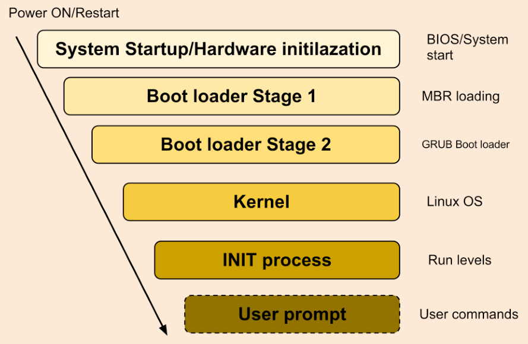
4. 系统调用：计算机的各种硬件资源是有限的，为了更好的管理这些资源，用户进程是不允许直接操作的，所有对这些资源的访问都必须由操作系统控制。为此操作系统为用户态运行的进程与硬件设备之间进行交互提供了一组接口，这组接口就是所谓的系统调用。
5. 操作系统结构
   * 单体结构：操作系统的基本结构
    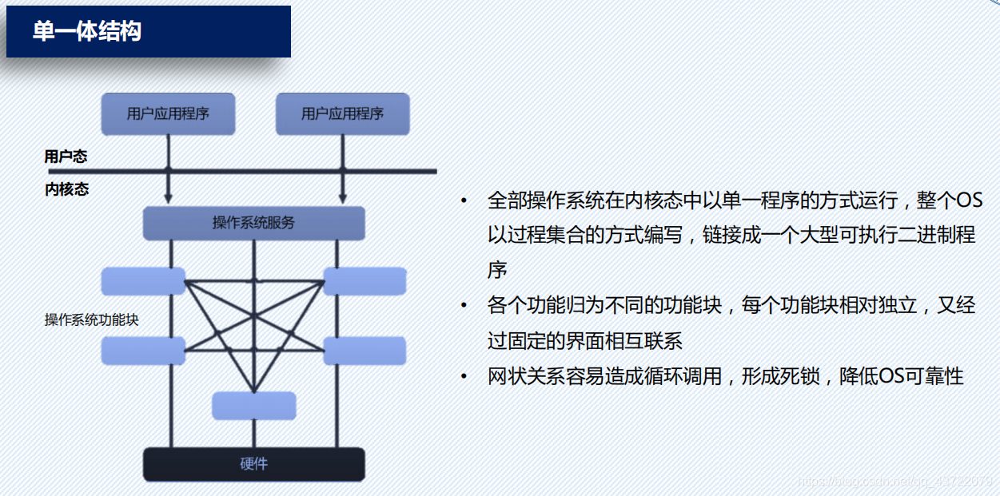
   * 层次式结构
    
    优点：容易拓展，可以构造用户子系统
   * 微内核
    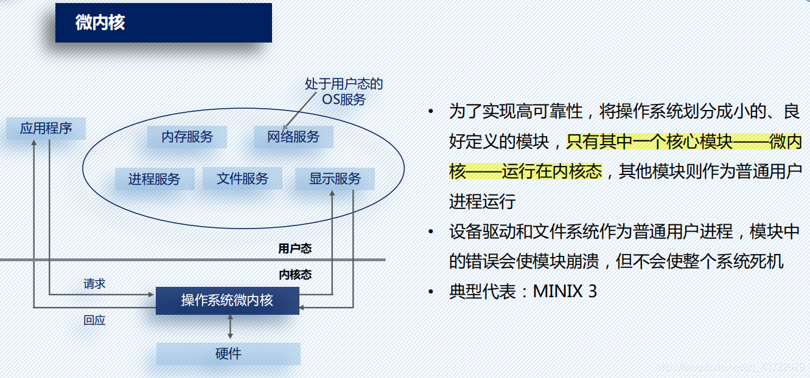
   * 客户端-服务器模式
    将进程划分为两类：服务器，每个服务器提供某种服务；客户端，使用这些服务。客户端和服务器之间的通信以消息传递的方式进行。
   * 虚拟机
    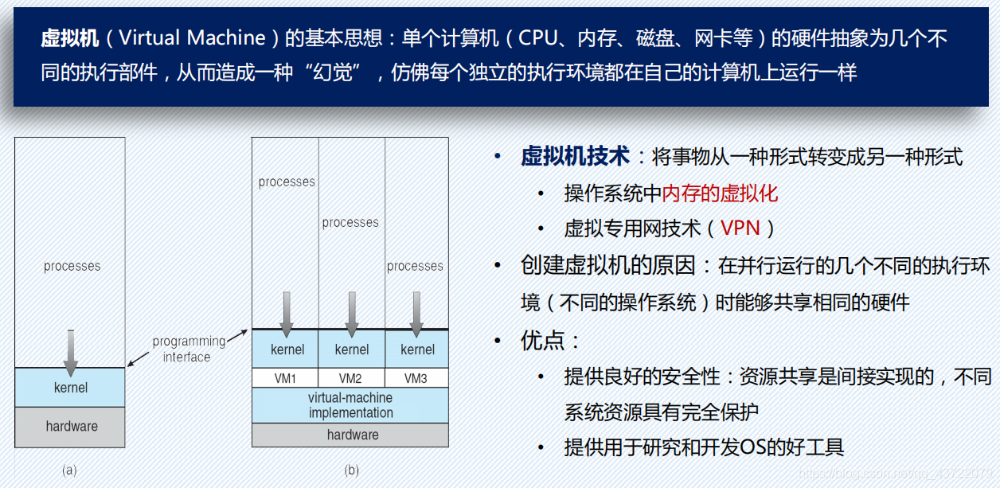
   * 外核
    与虚拟机克隆真实机器不同，外核对机器进行分区。在底层中，一种称为外核的程序在内核态运行，它负责为虚拟机分配资源，并检查使用这些资源的企图，以确保没有机器会使用他人的资源。
    优点是减少了映像层，将多道程序(在外核内)与用户操作系统代码(在用户空间内)加以分离，而且相应负载并不重。
6. 策略与机制分离
「将策略与机制相分离」是操作系统乃至计算机系统中控制复杂度的一个重要设计原则。其中 **机制** (mechanism) 表示该「如何做」，即实现某一功能的具体执行机构，常常位于系统的底层；**策略** (policy) 表示「做什么」，即在机制的基础上，借助一些参数或算法的变化，以达到对该功能的优化，或者达到不同的功能目标，常常位于系统的高层。
常见的例子有：
   - 登录功能：以什么用户、什么权限登录属于策略；输入处理、策略文件管理、桌面启动加载属于机制。
   - 调度功能：假设内核使用优先级调度算法，并提供了一条可供进程设置并改变优先级的系统调用。这样，尽管父进程本身不参与调度，但它可以控制如何调度子进程的细节。在这里，调度机制位于内核，而调度策略则有用户进程决定。
   
# 第二章：进程与线程
1. 原语: 是由若干个机器指令构成的完成某种特定功能的一段程序，具有不可分割性。即原语的执行必须是连续的，在执行过程中不允许被中断。
2. 进程
   * 概念：一个进程就是一个正在执行的程序的实例，包括程序计数器、寄存器和变量当前的值。
   * PCB: 在内核中, 每个进程都通过一个数据结构来保存它相关的状态, 如它的进程标识符 PID、进程状态、虚拟内存状态、打开的文件等, 这个数据结构称为进程控制块 PCB。
   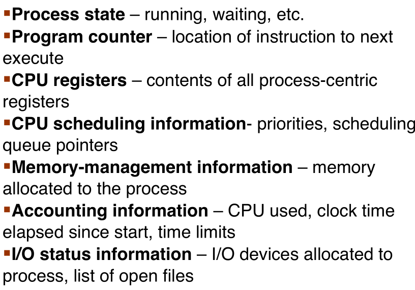
   * folk() 
   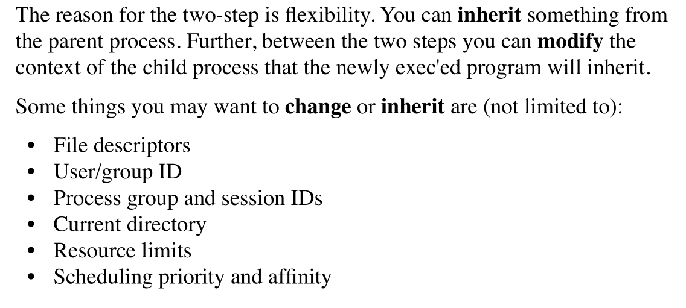
   * 五态模型
      1. 新生态 (new): 表示一个进程刚刚被创建出来, 还未完成初始化, 不能被调度运行. 经过初始化后, 进程进入预备状态. 
      2. 就绪态 (ready): 该状态表示进程可以被调度执行, 但还未被调度器选择. 在被调度器选择执行后, 进程进入运行状态. 
      3. 运行态 (running): 该状态表示进程正在 CPU 上运行. 当一个进程执行一段时间后, 调度器可以选择中断它并放回调度队列, 进而进入预备状态. 如果进程需要等待一些外部事件, 例如某个 I/O 请求的完成, 就可以放弃 CPU 进入阻塞状态. 当进程运行结束, 它就会进入终止状态. 
      4. 阻塞态 (blocked): 该状态表示该进程需要等待外部时间, 例如某个 I/O 的完成, 暂时无法被调度. 当该进程等待的外部事件完成后, 就会进入预备状态. 
      5. 终止态 (terminated): 该状态表示进程已经完成了执行, 且不会再被调度.
      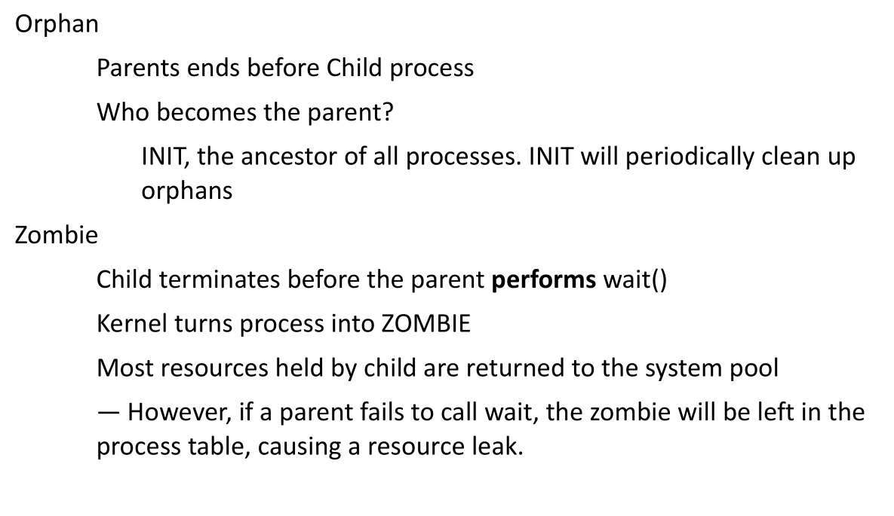
   * 多道程序设计
      - CPU 利用率: 用于真实计算的 CPU 时间比例
         假设等待 I/O 时间与停留内存时间之比为 $p$, 则 $n$ 个独立进程的 CPU 利用率为 $1-p^{n}$.
      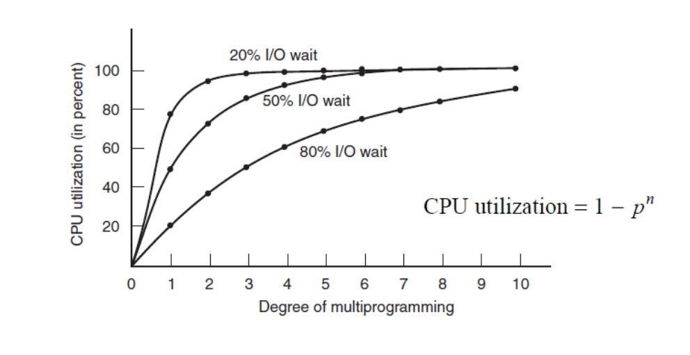
      
3. 进程通信(IPC)
   * 三种范式
     - 生产者消费者模式：一个进程的输出作为另一个进程的输入。这样的通信是单向的，生产者只负责写，消费者只负责读。常见的例子有管道（pipe）。
     - 客户端服务端模式：允许进程之间的双向通信，一个进程给另一个进程发送信息之后，可以收到回复。常见的例子有套接字（socket）。
     - 文件系统模式：进程之间可以通过读写文件的方式来交流信息。这种通信方式可以在时间上分离。
   * 两种实现方法
     - 共享内存
         in and out 方式， count 方式 (会触发竞争条件)
     - 消息传递
       使用两条原语send和receive
     - 比较
         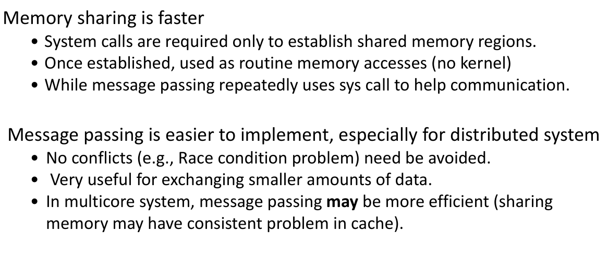
   * Examples
     - Posix memory sharing
      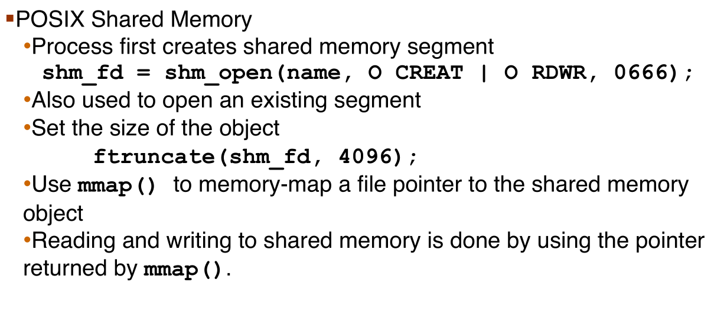
     - sockets
     - pipes
      [details](https://blog.csdn.net/studyhardi/article/details/89852839)
     - Signals
4. 线程
   * 为什么需要线程
      - 在许多应用中同时发生着多种活动。其中某些活动随着时间的推移会被阻塞。通过将这些应用程序分解成可以准并行运行的多个顺序线程，程序设计模型会变得更简单。
      - 线程比进程更加轻量级，所以它们比进程更容易(即更快)创建，也更容易撤销。
      - 若一个应用程序存在着大量的计算和大量的I/O处理，拥有多个线程允许这些活动彼此重叠运行，从而会加快应用程序执行的速度。
   * 定义
      线程是进程中的一个实体，是被系统独立调度和分派的基本单位，线程自己不拥有系统资源，只拥有一点儿在运行中必不可少的资源，但它可与同属一个进程的其它线程共享进程所拥有的全部资源。
   * 经典线程模型
      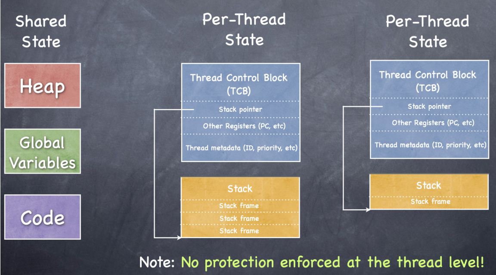
   * 线程五态
      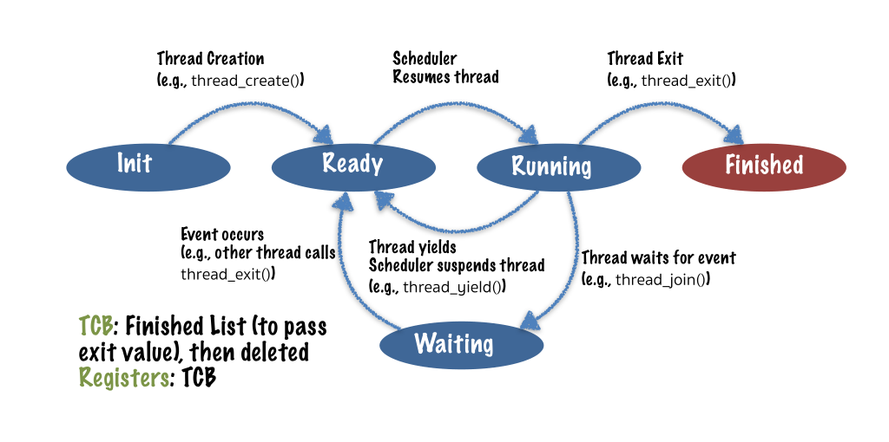
   * POSIX线程
      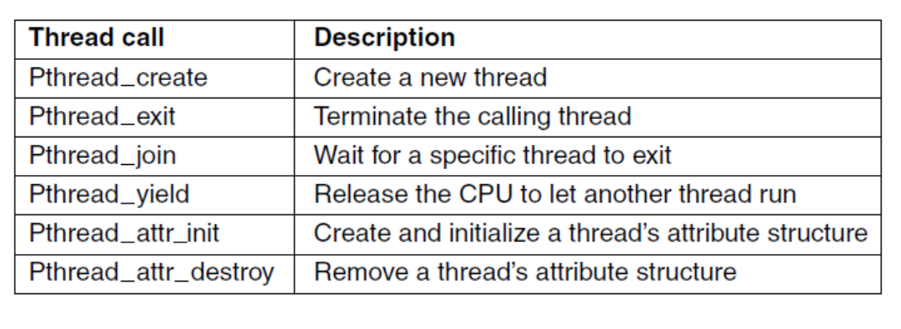
   * 用户级线程
   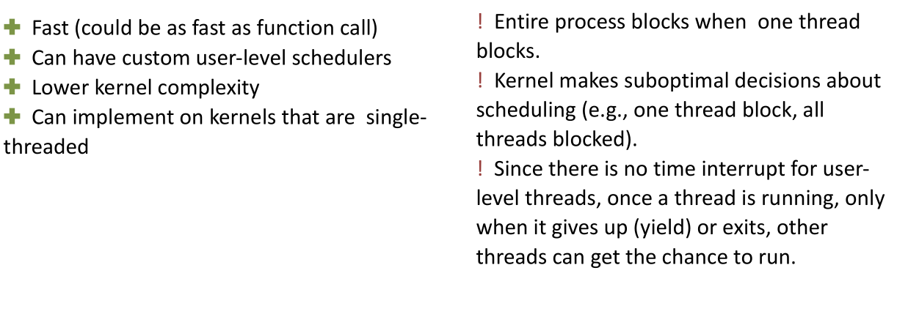
   * 内核级线程
   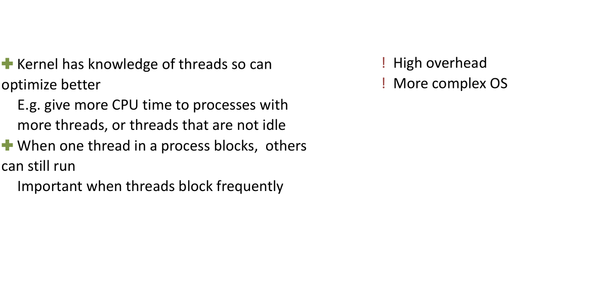
   * 混合实现
5. 调度算法
   * 调度的指标
      1. 吞吐量: 系统每小时完成的作业数量.
      2. 周转时间: 从一个批处理作业提交时刻开始, 直到该作业完成时刻为止的统计平均时间.
      3. CPU 利用率: CPU 利用率常常用于对批处理系统的度量.
      4. 响应时间: 对于交互式系统来说很重要, 即从发出命令到得到响应之间的时间.
      5. 均衡性: 用户对一件事情需要的时间的固有看法.
      6. 截止时间: 实时系统必须要满足截止时间.
      7. 可预测性: 涉及多媒体的实时系统, 人的耳朵和眼睛十分灵敏, 所以进程调度必须是高度可预测和有规律的.
   * 批处理系统的调度
      1. 先来先服务 (FCFS, FIFO): 当新作业进入, 排到队尾; 当进程被堵塞, 就接着运行队头任务; 当阻塞进程变为就绪时, 进入队尾.
      2. 最短作业优先 (SJF)
      3. 最短剩余时间优先 (SRTN)
   * 交互式系统中的调度
      1. 轮转调度 (RR)
      2. 优先级调度 (PS)
      3. 多级反馈队列 (MLFQ)
          1. 每个任务一开始处于最高优先级，当用完一个时间片后，优先级降低一级。
          2. 低优先级的任务采用更长的时间片.
          3. 定时地将所有任务地优先级提升到最高, 保证不会有饥饿.
          4. Game the system: 进程在时间片用完之前, 调用一个无用的 I/O 操作, 主动放弃 CPU, 从而保持在高优先级, 占据更多的 CPU 时间. 我们可以追踪记录进程在一个很大的时间周期 (几个时间片) 中运行的总时间, 然后给每个优先级赋予一个最大的 CPU 总时间.
         
      4. 保证调度
      5. 彩票调度
   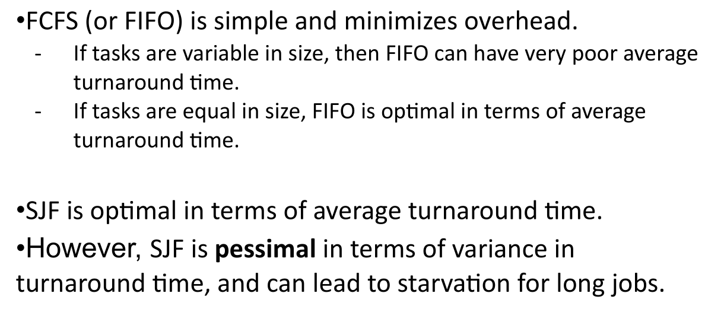
   
   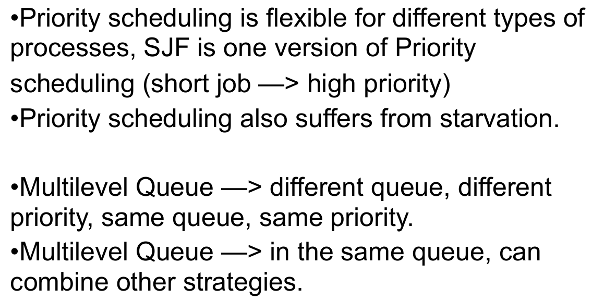
   
   
   * 实时系统的调度
      1. 准入控制: 假设有 $m$ 个任务, 其中第 $i$ 个任务的运行时间记为 $C_i$, 周期记为 $T_i$, 任务在单位时间内对 CPU 的利用率则为 $C_i / T_i$, 则总 CPU 利用率 $U = \sum_{i=1}^{m} C_i / T_i \le 1$.
      2. 单调速率调度 (RM)
          1. 速率指的是任务的到达速率, 它是任务周期的倒数, 即 $1 / T$.
          2. 需要预测任务的周期 $T$, 并且通过周期静态地为每个任务分配一个优先级, 任务的周期越短, 则优先级越高, RM 策略还支持抢占调度, 高优先级任务可以强制低优先级任务执行.
          3. Rate-monotonic scheduling is considered
         optimal in that if a set of processes cannot be scheduled by this algorithm, it cannot be scheduled by any other algorithm that assigns static priorities.
          4. RM 策略需要调度 $N$ 个任务时, 最坏情况下的 CPU 利用率为 $N * (2^{1 / N} - 1)$. 两个任务约为 $83\%$, 无限多个任务时约为 $69\%$.
      3. 最早截止期限优先 (EDF)
      动态优先级最优
6. 线程调度
   * 用户级线程
   * 内核级线程
# 第三章：内存管理
1. 内存管理: 管理所有和内存相关的操作和保存在主存中的资源, 使得多个进程能够使用主存和资源.
   * 记录所有被用到的内存;
   * 动态分配内存，回收不需要的内存;
   * 权限管理和内存保护;
   * 拓展物理内存大小的限制；
   * 最大化内存使用率和系统处理能力.
2. 无存储器抽象：
   * 可实现多程序：使用静态重定位(在装载程序的时候在地址引用处加上偏移量)。但是会减慢装载速度。
3. (一种存储器抽象)地址空间：一个进程可用于寻址内存的一套地址集合，这些地址是连续的。每个进程都有一个自己的地址空间，这个地址空间独立于其他进程的地址空间(除了特殊情况下进程需要共享它们的地址空间)。是正在运行的程序的内存视角。
   * 物理地址：将物理内存看成⼀个⼤数组，如果是按照字节编址的话，其中每个字节都可以通过与之唯⼀对应的地址进⾏访问，这个地址就是物理地址。seen by memory unit。
   * 虚拟地址：seen by the process

4. 虚拟地址和物理地址：
   - 虚拟地址空间是一个进程或程序所使用的虚拟内存的集合。每个进程在执行时都被分配一个独立的虚拟地址空间，它提供了一个抽象的地址范围，使得进程可以访问自己独立的内存空间，而不需要与其他进程共享实际物理内存地址。
   - 物理地址空间是指计算机系统中实际可用的物理内存地址的集合。它表示计算机系统中的物理存储器的地址范围。

5. MMU:
   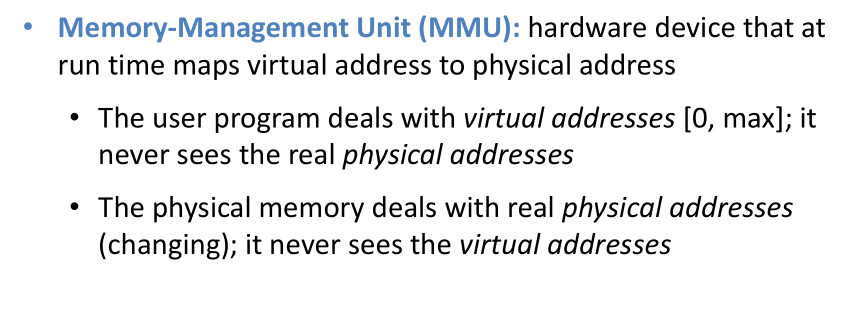
   
6. 进程级管理(连续内存分配)：
   * 地址转换：动态重定位-使用基址寄存器和界限寄存器将每个进程的地址空间映射到物理内存的不同部分.
   
   * 连续内存分配:
     - 首次适配 (first fit): 沿着链表搜索, 直到找到一个空闲区.
     - 最佳适配 (best fit): 搜索整个链表, 找出能够容纳进程的最小空闲区.
     - 最差适配 (worst fit): 总是分配最大的可用空闲区.
     - 快速适配 (quick fit): 为常用的空闲区维护单独的链表, 类似按照大小对空闲区链表排序, 以便提高最佳适配算法的速度.
   * 内部碎片和外部碎片
     - 内部碎片（Internal Fragmentation）指的是在内存分配过程中，由于分配的内存块大小超过了实际需要的大小而导致的浪费。当一个进程请求分配一块内存，但由于内存分配单位的固定性，分配给进程的内存块大小可能会略大于进程实际需要的大小。这导致分配的内存块中存在未被利用的部分，即内部碎片。内部碎片浪费了可用内存空间，降低了内存的利用率。
     - 外部碎片（External Fragmentation）指的是内存中存在的一些零散的未分配内存空间，这些空间的总和足够满足新的内存分配请求，但由于分散在不同位置，无法满足单个连续内存块的分配需求。外部碎片是由于不连续的内存分配和释放操作造成的。即使总的可用内存空间足够，但由于分配空间的碎片化，无法满足某些大块连续内存的需求，导致内存无法有效利用。
     - 内部碎片主要发生在固定分区或固定大小的内存分配中，其中每个分区或内存块都具有固定的大小。外部碎片则主要发生在动态分区或可变大小的内存分配中，其中内存块的大小可以根据请求进行调整。
     - 为了解决内部碎片和外部碎片的问题，操作系统和内存管理算法采用了各种技术，如动态分区分配、紧凑算法、内存回收和碎片整理等，以最大限度地提高内存利用率，并减少碎片化带来的影响。

  
7. 分段管理：
   * 段表结构: 每个进程都有段表, 其中每一项均包含
        - 段基址 (Segment Base): 段的开始物理地址.
        - 段限制 (Segment Limit): 段的空间大小.
        - 有效位 (Validation Bit): 段是否有效.
        - 权限: 段的读写和执行权限.
    * 分段地址转换
        - 段表基址寄存器 (STBR): 指向段表的其实位置.
        - 段表长度寄存器 (STLR): 指示了段表的段的数目.
        - 物理地址 = 偏移 + 段基址.
    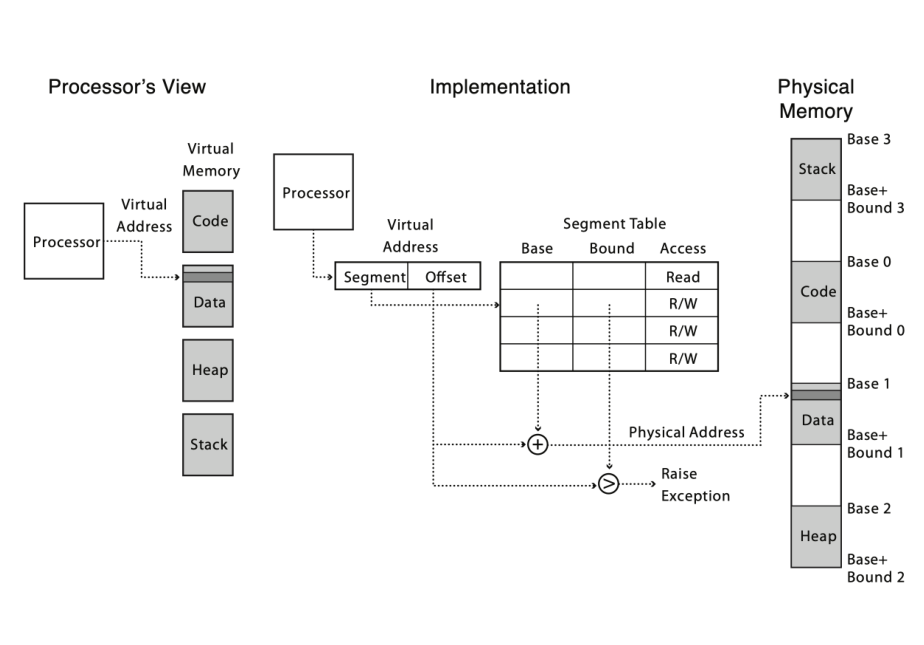
    * 支持共享：The same physical segment in memory could be mapped into multiple virtual address spaces。
    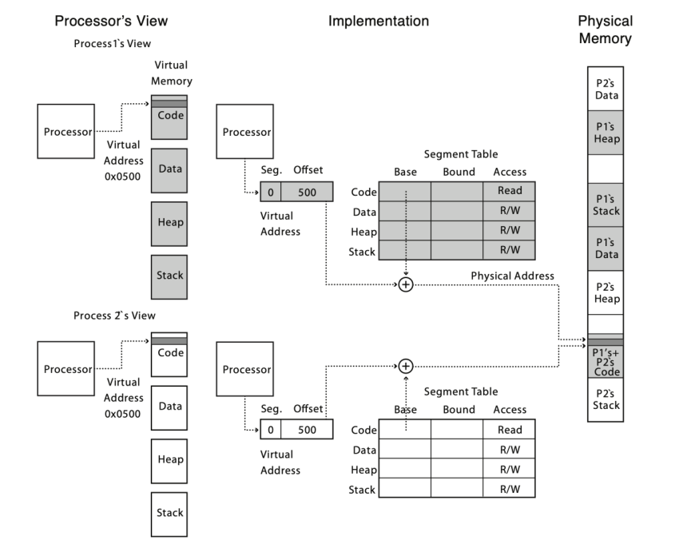
8. 分页管理：
    * 页框: 虚拟地址空间按照固定大小划分为被称为页面的若干单元, 在物理内存中对应的单元称为页框.
    * 页表项: 不同计算机的页表项大小可能不一样, 但是 32 位是一个常用的大小. 常包括页框号、保护位、修改位 (脏位)、访问位和禁用高速缓存位. 修改位和访问位对页置换算法很有用, 禁用高速缓存位对内存映射 I/O 很有用.
    * 多级页表: 32 位的虚拟地址常常被分为 10 位的 PT1 域、10 位的 PT2 域和 12 位的偏移量, 这样能够解决页表过大的问题.
    * 倒排页表: 内存中的每个页框对应一个表项, 而不是每个虚拟页面对应一个表项. 但是这样会导致虚拟地址到物理地址会很困难, 解决这种困难的方法是 TLB 和散列表.
    * 支持共享：
    * 写时复制
      在UNIX中，当一个进程复制（fork）自身创建一个新进程时，初始时新进程与原进程共享同一个内存空间。这意味着，新进程与原进程共享同一份内存页。当其中一个进程修改了这个内存页的内容时，就会触发写时复制机制。
      具体实现方式是，在写时复制发生时，操作系统会为新进程创建一个独立的内存页副本，并将修改的内容写入到新的内存页中。这样，原进程和新进程拥有各自独立的内存页，彼此不再共享。这样做的好处是避免了无谓的内存复制，节省了内存和时间。
    * TLB:
      - 通常在 MMU 中, 包含少量的表项, 一般不会超过 256 个, 每个表项包括有效位、虚拟页面号、修改位、保护位和页框号. 
      - 工作时, 硬件将虚拟页号与 TLB 中所有表项并行比较并匹配, 如果发现了有效的表项, 则就不用访问页表. 如果 MMU 检测到没有有效匹配项, 则会查找页表, 然后从 TLB 中淘汰一个表项.
      - TLB 一致性: 一旦上下文切换, PTBR 寄存器发生变化, 就要冲刷一次 TLB.
      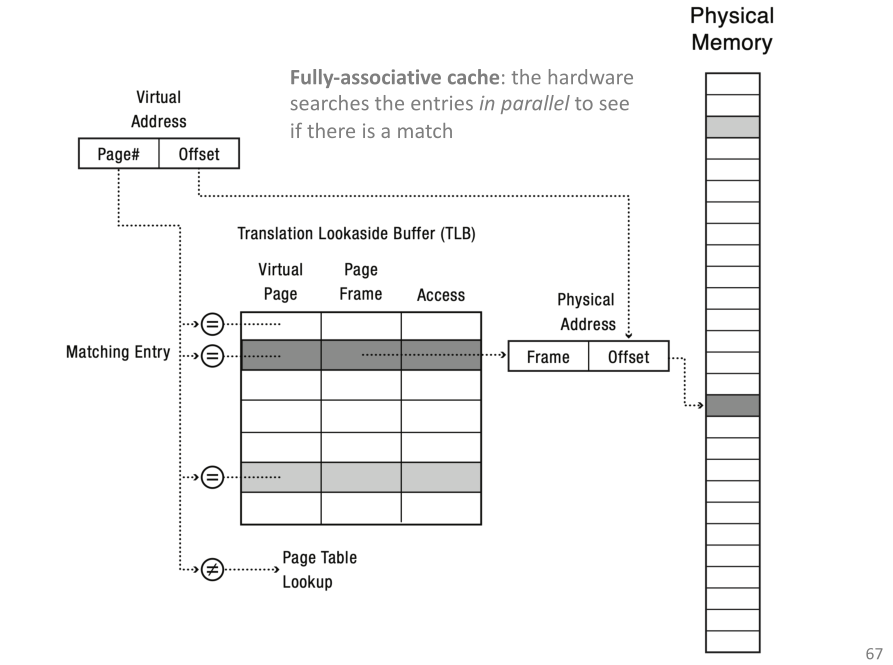 
      - 有效访问时间 (Effective access time): $\text{EAT} = (\varepsilon + t) \alpha + (\varepsilon + 2t)(1 - \alpha)$
        - 命中率 ($\alpha$): 页号在 TLB 中找到的次数的百分比.
        - 内存访问时间 ($t$).
        - TLB 搜索时间 ($\varepsilon$).
    * TLB miss:
    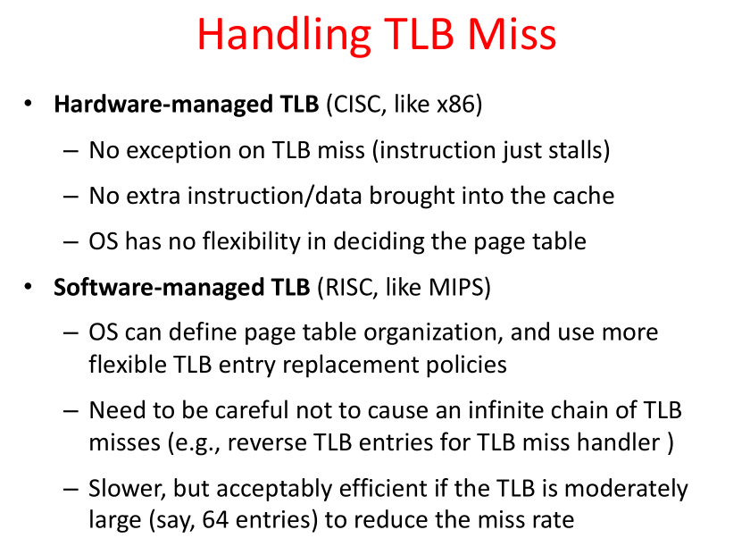
    * Virtually Addressed Cache:
    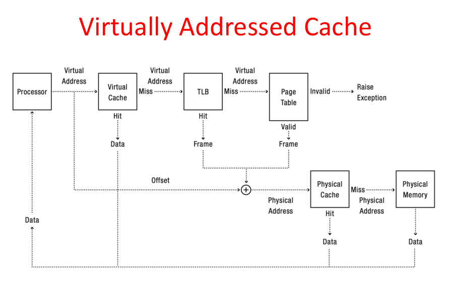
9. 分段分页比较：
   
10. 段页管理：
   * Address translation:
     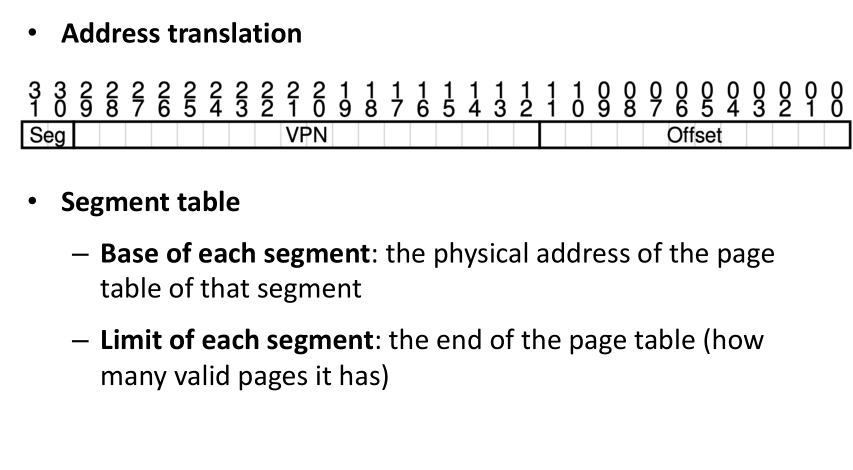
     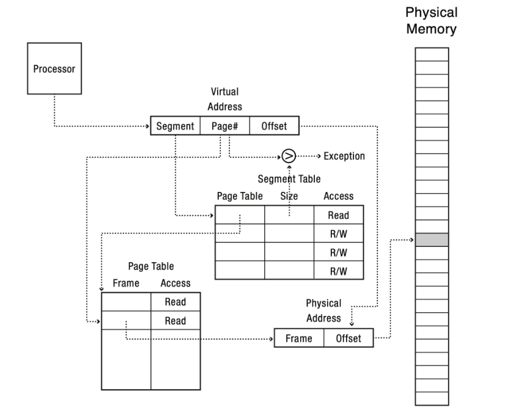
11. 虚拟内存
    * 请求调页: 当应用程序申请分配内存时, 操作系统可以选择将新分配的虚拟页标记为已分配但未映射到物理内存的状态, 而不必为这个虚拟页分配对应的物理页. 当应用程序访问这个虚拟页的时候, 会触发缺页异常, 这时候才真正为其分配物理页.
    * 缺页异常
        1. 硬件陷入内核, 在堆栈中保存 PC.
        2. 启动一个汇编代码历程保存通用寄存器和其他易失信息.
        3. 发现缺页中断, 尝试就找需要哪个虚拟页.
        4. 检查虚拟页地址是否有效, 然后检查是否有空闲页框, 如果没有, 则执行页面置换算法来找一个页面来淘汰.
        5. 如果选择的页框是脏的, 则安排该页写回磁盘, 并由于 I/O 操作而发生一次进程调度.
        6. 一旦页框干净, 则查找所需页面在磁盘上的地址, 通过 I/O 操作装入内存, 同样发生进程调度.
        7. 磁盘中断发生时, 表示该页已经载入, 页表也可以更新, 以反映它的位置.
        8. 恢复发生缺页中断以前的状态, PC 重新指向这条指令.
        9. 调度引发缺页中断的进程.
        10. 恢复寄存器和其他状态信息, 返回用户空间继续执行.
12. 页面替换算法：
   * FIFO: 替换最早调入的页面
   * LRU(最近少使用)：替换最近不使用的页面(最近一次访问时间最早)
   * 第二次机会：替换掉R位为0的页面中，最早调入的。ps：如果第一遍遍历中R位均为1，则第二遍就变为FIFO算法。
   * 时钟算法：和第二次机会算法本质一样，只是用一个循环的方式来表示每个页面。
   * NRU(最近未使用): 随机从类编号最小的非空类选择一个页面淘汰。
    类编号：(0, 0), (0, 1), (1, 0), (1, 1)
   * 老化算法：选择计数器最小的页面替换(计数器初始化全0)。
   * 缺页中断率 (Page Fault Frequency) 和页框分配
        1. 页替换有两种策略分类, 一是全局页替换, 考虑所有的进程; 二是局部页替换, 只考虑当前进程.
        2. 为了使用全局页替换算法, 必须保证每个进程都有一定的页面, 根据进程大小按比例为其分配页面也是可能的, 但是需要动态管理内存分配, 其中一种办法就是 PFF 算法. 它指出了何时增加或减少分配给某一个进程的页面.
        3. 测量缺页中断率的方法是直截了当的: 计算每秒的缺页中断数, 也可能取前几秒的平均. 如果中断率低于某个值, 进程就失去页框; 如果中断率高于某个值, 进程就得到页框.
   * 工作集页面置换算法
      1. 工作集: 一个进程当前正在使用的页面的集合称为它的工作集. 它是随着时间变化而发生变化的. 定义上, 工作集就是最近 $k$ 次内存访问所使用过的页面的集合.
      2. 颠簸: 如果每执行几条指令程序就发生一次缺页中断, 那么就称这个程序发生了颠簸.
      3. 访问局部性: 在进程运行的任何阶段, 它都只访问较少的一部分页面.
      4. 工作集置换算法: 当发生页中断时, 淘汰一个不在工作集中的页面.

13. 小结：
   

