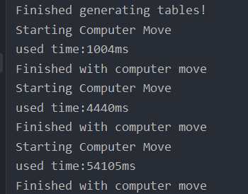
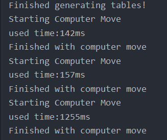

# 黑白棋实验报告 

## 211300063 张运吉

--------------------------------------------------------------

### 任务1：介绍MiniMax搜索的实现

``MiniMAXDecider``类中有四个成员变量``private boolean maximize``,``private int depth``,``private Map<State, Float> computedStates``,``private static final boolean DEBUG = true``,
其中``maximize``作为一个开关，选择某一层是使用Max还是使用Min进行评估，``depth``是递归的最大深度，``computedStates``存储``(state，value)``二元组，这是为了避免对同一个状态重复评分，``DEBUG``在MinMax算法中没有使用。

``MiniMAXDecider``类中有四个方法，构造函数``MiniMaxDecider``负责初始化对象的成员变量；``decide``函数和``miniMaxRecursor``函数是实际进行搜索的部分，接下来将详细介绍；``finalize``函数直接返回传入的参数``value``。

``decide``函数中的``float value``变量保存该状态下的最佳得分，``List<Action> bestActions``保存最佳得分对应的最佳动作，最佳得分的定义如下：如果``maximize``为``true``，则代表当前状态是max层，初始化``value``为
一个负无穷小的值，``flag``设为1，然后对当前局面所有可能的动作进行遍历，得到新的局面，根据新的局面用``miniMaxRecursor``函数计算对应的得分，并将得分乘以``flag``后与当前的最优得分乘以``flag``后比较，如果前者大于后者，即Max函数中新局面得分大于最高得分/Min函数中新局面得分小于最低得分时，对最优得分进行更新。
最后会对``bestActions``进行更新(``maximize``为false同理)。
```java
public Action decide(State state) {
    // Choose randomly between equally good options
    float value = maximize ? Float.NEGATIVE_INFINITY : Float.POSITIVE_INFINITY;
    List<Action> bestActions = new ArrayList<Action>();
    // Iterate!
    int flag = maximize ? 1 : -1;
    for (Action action : state.getActions()) {
        try {
            // Algorithm!
            State newState = action.applyTo(state);
            float newValue = this.miniMaxRecursor(newState, 1, !this.maximize);
            // Better candidates?
            if (flag * newValue > flag * value) {
                value = newValue;
                bestActions.clear();
            }
            // Add it to the list of candidates?
            if (flag * newValue >= flag * value) bestActions.add(action);
        } catch (InvalidActionException e) {
            throw new RuntimeException("Invalid action!");
        }
    }
    // If there are more than one best actions, pick one of the best randomly
    Collections.shuffle(bestActions);
    return bestActions.get(0);
}

```

``miniMaxRecursor``方法是根据传入的``State``计算局面的最优分数，具体地，它的实现步骤如下：
1.判断当前状态是否被搜索过 2.判断当前状态对局是否结束 3.判断深度是否达到最大 4.若以上三点都不满足，则递归向下搜索，这里需要注意的是，调用这个函数(上一层)时，传入的``maximize``是取反后的，这样能达到的目的
是Max层和Min层交替。评估函数``state.heuristic()``我们之后会介绍。
```java
public float miniMaxRecursor(State state, int depth, boolean maximize) {
    // Has this state already been computed?
    if (computedStates.containsKey(state)) 
                // Return the stored result
                return computedStates.get(state);
    // Is this state done?
    if (state.getStatus() != Status.Ongoing)
                // Store and return
                return finalize(state, state.heuristic());
    // Have we reached the end of the line?
    if (depth == this.depth)
                //Return the heuristic value
                return state.heuristic();
            
    // If not, recurse further. Identify the best actions to take.
    float value = maximize ? Float.NEGATIVE_INFINITY : Float.POSITIVE_INFINITY;
    int flag = maximize ? 1 : -1;
    List<Action> test = state.getActions();
    for (Action action : test) {
        // Check it. Is it better? If so, keep it.
        try {
            State childState = action.applyTo(state);
            float newValue = this.miniMaxRecursor(childState, depth + 1, !maximize);
            //Record the best value
                            if (flag * newValue > flag * value) 
                                value = newValue;
        } catch (InvalidActionException e) {
                            //Should not go here
            throw new RuntimeException("Invalid action!");
        }
    }
    // Store so we don't have to compute it again.
    return finalize(state, value);
}
```

如此一来，MiniMax搜索得以实现。

### 任务2：修改MiniMaxDecider类，加入AlphaBeta剪枝

我的修改是在``miniMaxRecursor``中加了两个参数``float alpha``,``float beta``,第一次调用是给``alpha``和``beta``
传入负无穷大和正无穷大，然后就是在``miniMaxRecursor``添加相关的剪枝代码：

```java
try {
    State childState = action.applyTo(state);
    float newValue = this.miniMaxRecursor(childState, depth + 1, !maximize, alpha, beta);
    //Record the best value
    if (flag * newValue > flag * value)
        value = newValue;
    // alpha-beta剪枝
    if (maximize)
        alpha = Math.max(alpha, value);
    else
        beta = Math.min(beta, value);
    if (alpha >= beta)
        return finalize(state, value);
} catch (InvalidActionException e) {
    //Should not go here
    throw new RuntimeException("Invalid action!");
}
```

因为默认的搜索深度比较小，未剪枝时的搜索速度就比较快了，所以剪枝后速度对比不明显。所以我将搜索深度增大到8，剪枝带来速度的提升还是很明显的。
如下图所示，左边是未使用剪枝的时候，右边是使用剪枝的时候。

<center class="half">


</center>


### 任务3：理解othello.OthelloState类中的heuristic函数，并尝试改进

先介绍评估函数调用的四个函数的功能：``pieceDifferential``计算玩家1和玩家2棋子数量之差，
``moveDifferential``计算玩家1和玩家2可下位置之差，``cornerDifferential``计算玩家1和玩家2占据的棋盘四角位之差，
``stabilityDifferential``计算玩家1和玩家2可以翻转的棋子数之差。

最后返回的评估值是上面介绍的四个函数返回值和``winconstant``的加权和，权值分别是1、8、300、1、1；
``winconstant``的计算方式：若玩家1获胜则是5000，若是玩家2获胜则是-5000，若对局未结束则是0.
```java
@Override
public float heuristic() {
    //System.out.printf("%f %f %f %f\n",this.pieceDifferential(), this.moveDifferential(), this.cornerDifferential(), this.stabilityDifferential());
    Status s = this.getStatus();
    int winconstant = 0;
    switch (s) {
    case PlayerOneWon:
        winconstant = 5000;
        break;
    case PlayerTwoWon:
        winconstant = -5000;
        break;
    default:
        winconstant = 0;
        break;
    }
    return this.pieceDifferential() +
       8 * this.moveDifferential() +
      300 * this.cornerDifferential() +
       1 * this.stabilityDifferential() + 
       winconstant;
}
```


### 任务4：阅读并尽量理解MTDDecider类，介绍它与MiniMaxDecider类的异同

MTD算法：MTD-f算法只使用零窗口进行搜索，来搜索是否存在比下界值要大的值，如果是将新返回的值设为新的下界，否则设为新的上界，通过一系列的零窗口搜索，使原先初始的最优值边界从（-∞,+∞）逐渐收敛为一个确定的值，而这个值就是当前局面的最优值。同时MTD-f算法通过使用置换表技术，把已经搜索过的节点保存在内存中，来减少了对节点重复搜索的开销。

``MTDDecider``类有五个主要方法：``decide``函数是返回当前状态下使用MTD算法搜索出来的最佳动作，具体地，``decide``函数
会调用``iterative_deepening``函数，搜索是在这个函数里面进行的(下面会详细介绍)。

```java
private Action iterative_deepening(State root) {
    // Create ActionValuePairs so that we can order Actions
    List<ActionValuePair> actions = buildAVPList(root.getActions());
    checkedNodes = 0; cacheHits=0; leafNodes = 0;
    
    int d;
    for (d = 1; d < maxdepth; d++) {
        int alpha = LOSE; int beta = WIN; int actionsExplored = 0;
        for (ActionValuePair a : actions) {
            State n;
            try {
                n = a.action.applyTo(root);
                
                int value;
                if (USE_MTDF)
                    value = MTDF(n, (int) a.value, d);
                else {
                    int flag = maximizer ? 1 : -1;
                    value = -AlphaBetaWithMemory(n, -beta , -alpha, d - 1, -flag);
                }
                actionsExplored++;
                // Store the computed value for move ordering
                a.value = value;
                /*
                if (maximizer) {
                    alpha = Math.max(alpha, value);
                } else*/
                //	beta = Math.min(beta, value);
                    
                
                
            } catch (InvalidActionException e) {
                e.printStackTrace();
            } catch (OutOfTimeException e) {
                System.out.println("Out of time");
                // revert to the previously computed values. 
                //HOWEVER, if our best value is found to be catastrophic, keep its value.
                // TODO: this should keep all found catastrophic values, not just the first!
                boolean resetBest = true;
                if (actionsExplored > 1) {// If we have looked at more than one possible action
                    ActionValuePair bestAction = actions.get(0);
                    // check to see if the best action is worse than another action
                    for (int i=0; i < actionsExplored; i++) {
                        if (bestAction.value < actions.get(i).value) {
                            // don't reset the first choice
                            resetBest = false;
                            break;
                        }
                    }	
                }
                
                if (resetBest) {
                    for (ActionValuePair ac: actions) {
                        ac.value = ac.previousValue;
                    }
                } else {
                    for (int i=1; i < actionsExplored; i++) {
                        actions.get(i).value = actions.get(i).previousValue;
                    }
                }
                break;
            }
        }
        // Sort the actions for move ordering on the next iteration
        Collections.sort(actions, Collections.reverseOrder());
        
        // And update the previous value field
        for (ActionValuePair a: actions) {
            a.previousValue = a.value;
        }
        
        System.out.printf("%2.2f",0.001*(System.currentTimeMillis() - startTimeMillis));
        System.out.println(": " + d + ": "+actions.get(0));
        
        if (times_up()) {
            break;
        }
    }

    SearchStatistics s = new SearchStatistics();
    s.nodesEvaluated = leafNodes;
    s.timeSpent = (int) (System.currentTimeMillis() - startTimeMillis);
    s.searchDepth = d;
    statsList.add(s);
    
    double nodesPerSec = (1000.0*s.nodesEvaluated) / s.timeSpent;
    double EBF = Math.log(s.nodesEvaluated)/Math.log(s.searchDepth);
    double searchEfficiency = (1.0 * leafNodes) / checkedNodes;
        
    System.out.printf("NPS:%.2f EBF:%.2f eff:%.2f\n", nodesPerSec, EBF, searchEfficiency);
    System.out.println("Cache hits:"+cacheHits);
        
    System.out.println("Available actions:"+actions);
    return getRandomBestAction(actions);
}

```

``iterative_deepening``:这个函数以传入的``state``为根节点进行迭代加深搜索，根据``USE_MTDF``的值选择使用``MTDF``还是
``AlphaBetaWithMemory``函数计算局面得分，最后随机返回最佳动作集合中的一个动作;
迭代加深体现在两个for循环，外层for循环``for (d = 1; d < maxdepth; d++)``从初始深度为1开始，一步步加深搜索以防止搜索时间的限制，
内层for循环``for (ActionValuePair a : actions)``就是对某一深度的搜索。

```java
private int MTDF(State root, int firstGuess, int depth)
        throws OutOfTimeException {
    int g = firstGuess;
    int beta;
    int upperbound = WIN;
    int lowerbound = LOSE;

    int flag = maximizer ? 1 : -1;

    while (lowerbound < upperbound) {
        if (g == lowerbound) {
            beta = g + 1;
        } else {
            beta = g;
        }
        // Traditional NegaMax call, just with different bounds
        g = -AlphaBetaWithMemory(root, beta - 1, beta, depth, -flag);
        if (g < beta) {
            upperbound = g;
        } else {
            lowerbound = g;
        }
    }

    return g;
}
```

``MTDF``：MTDF函数进行迭代搜索，在迭代中调用了AlphaBetaWithMemory函数，并返回当前深度下minimax的最佳估计值。

```java
private int AlphaBetaWithMemory(State state, int alpha, int beta,
        int depth, int color) throws OutOfTimeException {

    /**
     * If we are not at a low depth (have at least more recursive calls
     * below us) then we are called infrequently enough that we can afford
     * to check if we are out of time
     */
    if (depth > 4) {
        if (times_up())
            throw new OutOfTimeException();
    }

    // Note that we checked a new node
    checkedNodes++;
    // Specify us
    // Has this state already been computed?
    SearchNode node = transpositionTable.get(state);
    // TODO: shoot myself. This code wasn't working because I had node.depth
    // >= depth rather than >
    if (node != null && node.depth >= depth) {
        cacheHits++;
        switch (node.type) {
        case EXACT_VALUE:
            return node.value;
        /*case UPPERBOUND:
            if (node.value > alpha)
                alpha = node.value;
            break;
        case LOWERBOUND:
            if (node.value < beta)
                beta = node.value;
            break;*/
        }
    }
    // Is this state/our search done?
    if (depth == 0 || state.getStatus() != Status.Ongoing) {
        int h;
        leafNodes++;
        h = (int) state.heuristic();
        int value = color * h;
        return saveAndReturnState(state, alpha, beta, depth, value, color);
    }

    int bestValue = LOSE;

    // Partial move ordering. Check value up to depth D-3 and order by that
    int[] depthsToSearch;
    if (depth > 4) {
        depthsToSearch = new int[2];
        depthsToSearch[0] = depth - 2; // TODO: this should be easily adjustable
        depthsToSearch[1] = depth;
    } else {
        depthsToSearch = new int[1];
        depthsToSearch[0] = depth;
    }

    List<ActionValuePair> actions = buildAVPList(state.getActions());
    // Do our shorter depth search first to order moves on the longer search
    for (int i = 0; i < depthsToSearch.length; i++) {
        for (ActionValuePair a : actions) {
            int newValue;
            try {
                State childState = a.action.applyTo(state);
                // Traditional NegaMax call
                newValue = -AlphaBetaWithMemory(childState, -beta, -alpha,
                        depthsToSearch[i] - 1, -color);
                // Store the value in the ActionValuePair for action ordering
                a.value = newValue;
            } catch (InvalidActionException e) {
                throw new RuntimeException("Invalid action!");
            }
            if (newValue > bestValue)
                bestValue = newValue;
            if (bestValue > alpha)
                alpha = bestValue;
            if (bestValue >= beta)
                break;
        }
        // Sort the actions to order moves on the deeper search
        Collections.sort(actions, Collections.reverseOrder());

    }
    return saveAndReturnState(state, alpha, beta, depth, bestValue, color);
}
```

``AlphaBetaWithMemory``:``AlphaBetaWithMemory``函数和运用了alpha-beta剪枝的``miniMaxRecursor``函数类似，置换表``transpositionTable``的作用是避免对重复局面进行搜索。该函数对不同的depth做了不同的处理，对于小于等于4的depth，直接按depth进行搜索；对于大于4的depth，如果搜索时间不够则抛出异常；
如果搜索时间够则分为深度分别为depth – 2和depth的两轮搜索。

与``MiniMaxDecider``的异同:相同之处在于就算``value``的方法比较相似，都是深度优先搜索(极大极小值搜索)搭配alpha-beta
剪枝，不同之处在于``MTDDecider``使用了迭代加深的搜索，可以返回在有限搜索时间内较准确的搜索结果，适用性更强。
