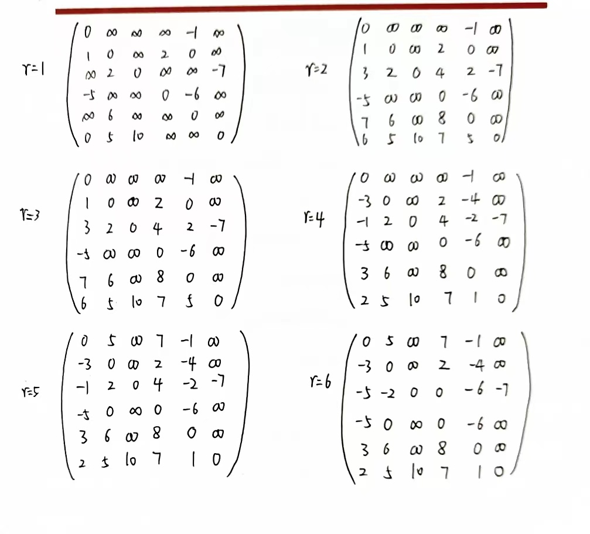
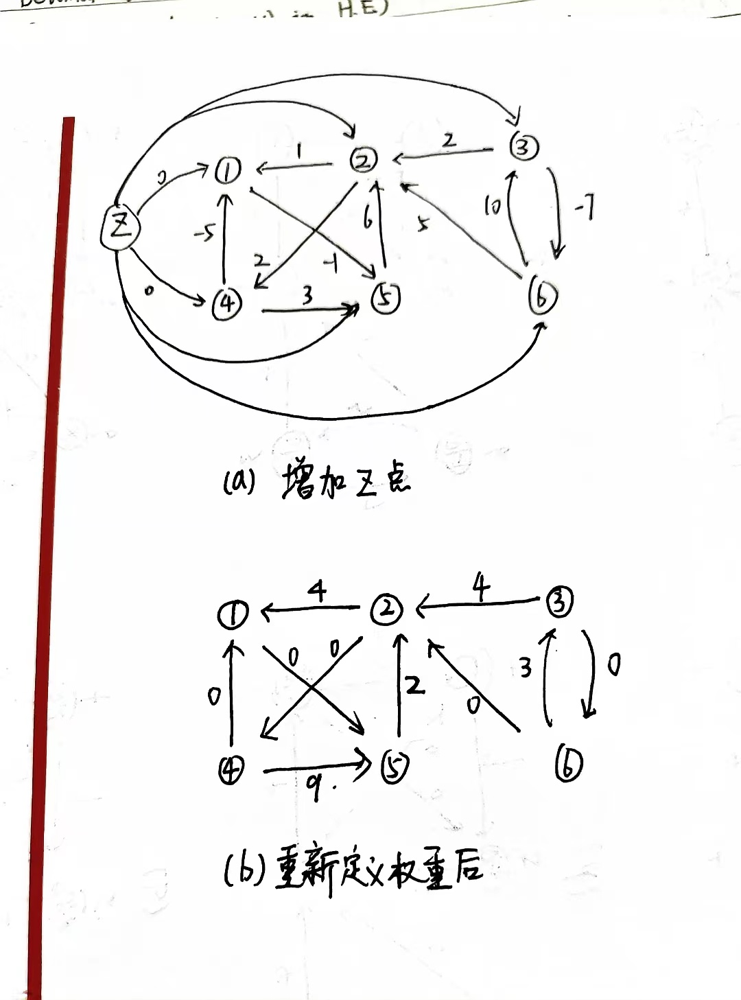
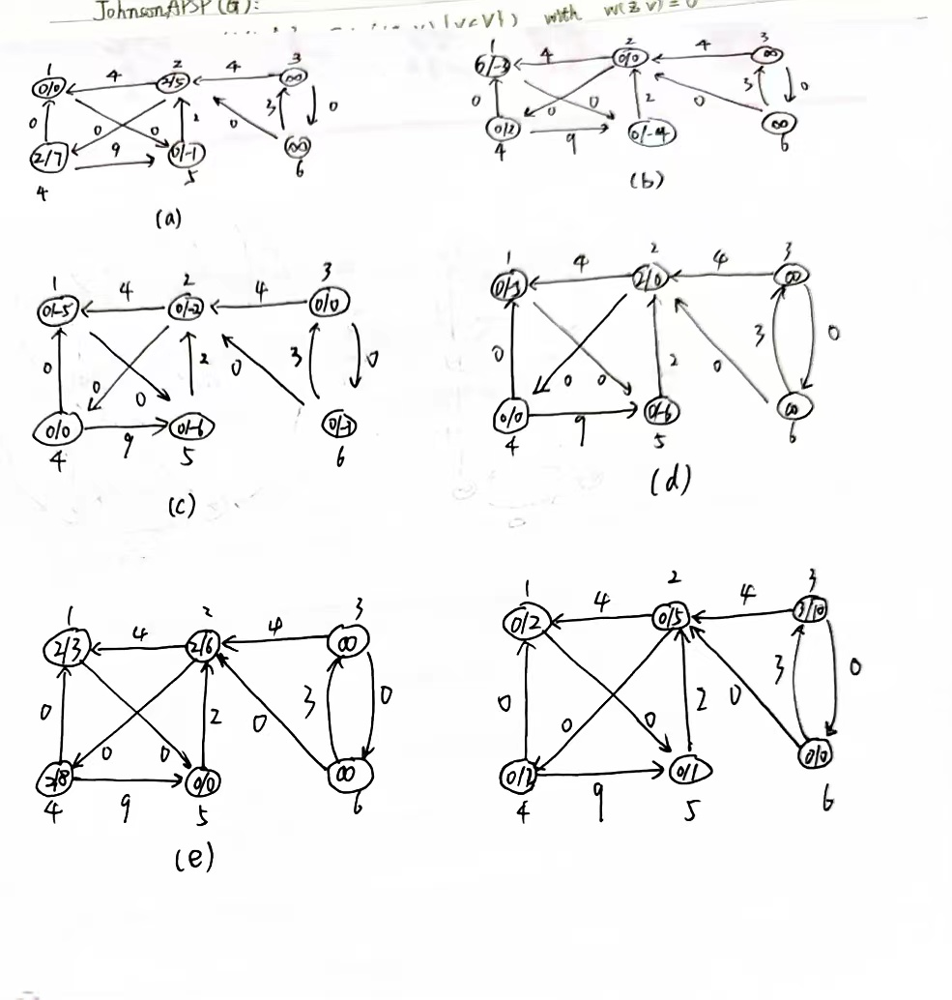

# Problem Set 12
# 211300063 张运吉
## P1
对原图中的每一条边，赋予权重0，把原图中的每个节点v分成两个节点$v_0$和$v_1$，并加入新的边($v_0$,$v_1$),这条边的权重是w(v)。因此，得到一个新图$G^{'}$,这个新图是一个对偶图。经过$G^{'}$上所有点的一条路径也是原图$G$上的一条路径。
### (a)
$d_{s_0}$初始化为0，然后使用PERT算法（DAG上的sssp算法）计算源节点$s_0$到每个节点的最短路径。$d_{v_0}$就是要求计算的v的最早开始时间。
伪代码:
```python
def PERT(G, s):
    TOPO-SORT(G)
    for each vertex v in G:
        v.d = INF
    s.d = 0
    for each vertex v in G (taken in topologically sorted order):
        for each edge (v, u) in G:
            if u.d > v.d + w((v, u)):
                u.d = v.d + w((v, u))
                u.p = v
def solve_a:
    preprocess G, get G'
    PERT(G', s0)
    return v0.d
```
### (b)
反转$G^{'}$中的每一条边得到图$G^{''}$,初始化$d^{'}_{t_1}=0$，然后以$t_1$为起点，使用PERT算法计算$t_1$到每个节点的最短路径。

$d_{t_1}-d^{'}_{v_0}$就是原图中v节点代表的任务最晚开始时间。

```python
def solve_b:
    reverse every edges, get G''
    PERT(G'', t1)
    return t1.d - v0.d'
```

### (c)
节点v在某条关键路径上$\iff$节点v的最早开始时间和最晚开始时间相等。

因为在这样一条关键路径上，任何节点都不能延期(最早开始时间和最晚开始时间之间的间隔),否则将会影响整个任务的时间。

```python
def solve_c:
    x = solve_a(v)
    y = solve_b(v)
    return x == y
```

时间复杂度：因为做了常数次PERT，所以时间复杂度是线性的.$T(n) = \Omicron(|V|+|E|)$

## P2
### (a)
构造有向图$G=(V, E)$, $V = \{c_1, c_2,...,c_n\}$
$(c_i, c_j) \in E \iff i \not ={j}$, $w((c_i, c_j)) = -\log r_{i,j}$

那么求解原问题变成了求解图G中节点s到节点t的最短路径，因为$-\log r_{i_1, i_2}-\log r_{i_2, i_3}...-\log r_{i_{k-1}, i_k}=-\log r_{i_1, i_2}\times r_{i_2, i_3}\times ... r_{i_{k-1}, i_k}$,所以如果要是s到t获得最大利益，那么$r_{s, i_2}\times r_{i_2, i_3}\times ... r_{i_{k-1}, t}$最大，也就是$-\log r_{s, j_1}\times r_{i_2, j_2}\times ... r_{i_k, t}$最小。

我们使用Bellman-ford计算s到t的最短路径。

伪代码:
```python
def solve:
    construct graph G
    BellmanFordSSSP(G,s)
    lst = []
    x = t
    while x != s: // 获取最短路径上的每个点
        lst.add(x.p)
        x = x.p
    return lst
```

### (b)
继续使用(a)构造的图，如果$r_{i_1, i_2}\times r_{i_2, i_3}\times ... r_{i_k, i_1} > 1$,那么$-\log r_{i_1, i_2}\times r_{i_2, i_3}\times ... r_{i_k, i_1} < 0 $,也就是图中出现负环，我们只需要在运行Bellman-ford算法的时候检测有没有负环即可。
```python
def solve:
    construct graph G
    BellmanFordSSSP(G,s)
    for each edge (u, v) in G:
        if v.dist > u.dist + w(u, v):
            return "has an anomaly"
    return "no an anomaly"
```
## P3
### (a)

### (b)
如果存在负环，那么算法输出的矩阵对角线元素会出现负数。

## p4
### (a)


### (b)
证： 根据引理25.1，可知：原图一个环上的所有边权重之和与重新定义权重后的环上的所有边权重之和相等。对于一个0-weight环c(假设为$v_0\rightarrow v_1\rightarrow ... \rightarrow v_n \rightarrow v_0 $)，重新定义权重后的环$c^{'}$，有$\hat{w}(c^{'}) =\hat{w}(a_0, a_1) + ... + \hat{w}(a_{n-1}, a_n)+\hat{w}(a_n, a_0)= 0$,因为重新定义权重后所有的边权重都大于等于0，所以$\forall (u,v) \in c, \hat{w}(u,v) = 0$.

## P5
### (a)
记新插入的边为$(u,v)$,我们可以按如下方法更新传递闭包：遍历闭包矩阵，找到u的父母和所有祖先p，然后找到v的所以后代c，再把$T[p][c]$设为true。

伪代码:
```python
def upadte(u, v):
    for x in V:
        if T[x][u] == true or x == u:
            for y in V:
                if T[v][y] == true or y == v:
                    T[x][y] = true
```

时间复杂度: 双重循环,$T(n) = \Omicron(|V|^{2})$

### (b)
对于图$G=(V,E)$
$$V=\{v_0, v_1, ... v_n\}, E=\{(v_0, v_1), (v_1, v_2), ..., (v_{n-1},v_{n})\}$$
如果加入边$(v_n, v_0)$,那我们一共要更新$\sum_{i=1}^{n-1}i=\frac{n(n-1)}{2}=\Omega(|V|^2)$次，无论采用什么算法。
### (c)
对(a)中的算法稍作修改，第3行改为:"if (T[x][u] == true or x == u) and T[x][v] != true:",因为若T[x][v] == true，那么就说明未插入边$(u,v)$之前x就能到达v，所以不必做后面的更新操作。

伪代码:
```python
def upadte(u, v):
    for x in V:
        if (T[x][u] == true or x == u) and T[x][v] != true::
            for y in V:
                if T[v][y] == true or y == v:
                    T[x][y] = true
```

时间复杂度：
因为T矩阵有$|V|^2$个元素，所以内层循环执行$\Omicron(|V|^2)$次，一共消耗时间$\Omicron(|V|^3)$；因为最多有$|V|(|V|-1)条边$，所以最多插入$\Omicron(|V|^2)$次，$x = \Omicron(|V|^2)$, 所以外层循环消耗时间$\Omicron(x\times n) = \Omicron(|V|^3)$
所以总时间：
$$ \Omicron(|V|^3)+ \Omicron(|V|^3) =  \Omicron(|V|^3)$$
## P6
使用动态规划来解决：

状态转移方程:$dp[i][j] = max(dp[i-1][j], dp[i-1][j-w[i]] + v[i])$

i表示对第i件物体决策，j表示当前背包剩余容量。

含义：对于第i件物体，有拿或者不拿两种情况，若拿，那么总价值就是$dp[i-1][j-w[i]] + v[j]$,若不拿，总价值就是$dp[i-1][j]$,我们取两者最大值就可以得到最优解。

伪代码:
```python
def solve:
    // 初始化dp第0行和第0列为0
    for i=0 to n:
        dp[i][0] = 0
    for i=0 to W:
        dp[0][i] = 0
    for i=1 to n:
        for j=W to 0:
            if j > w[i]: // 能拿
                dp[i][j] = max(dp[i-1][j], dp[i-1][j-w[i]] + v[i])
            else: // 不能拿
                dp[i][j] = dp[i-1][j]
    return dp[n][W]
```

时间复杂度：双重循环$T(n)=\Omicron(nW)$
