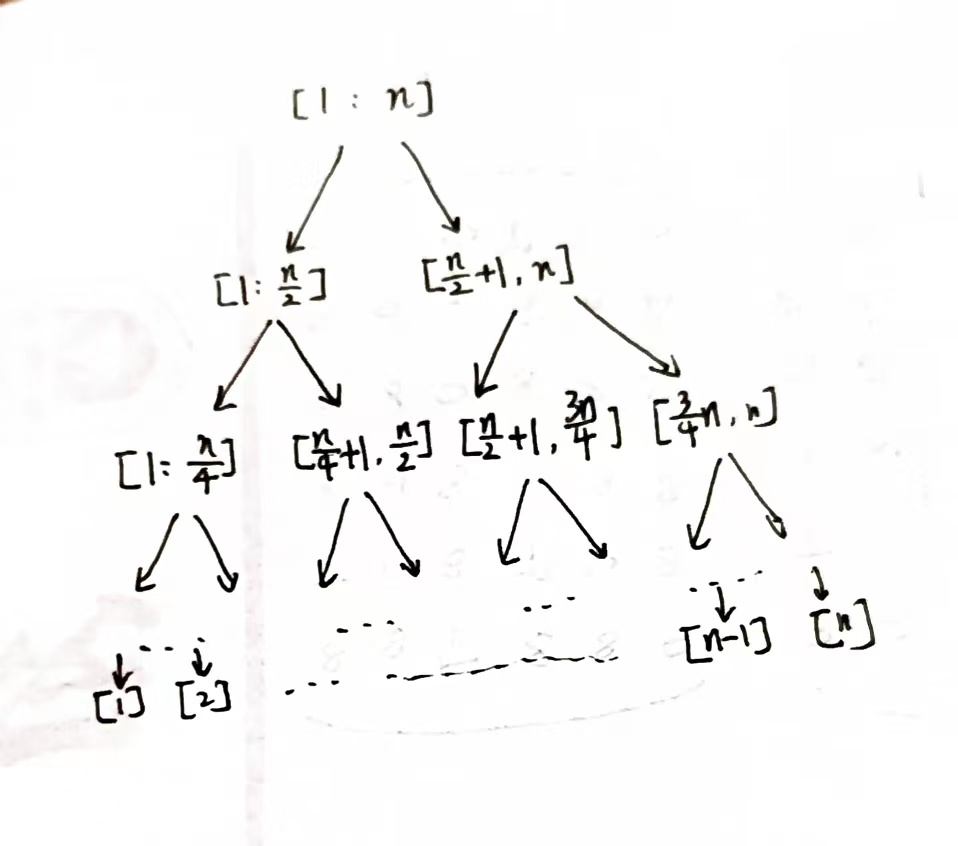

# Problem Set 13
# 211300063 张运吉
# P1
### (a)
假设一个子问题$subpro[l, r]$,定义它的长度$len=l-r+1$,长度为k的子问题一共有$(n+1-k)$个。

子问题图的每个节点都代表一个子问题，则原始大问题的子问题数量就是
$$|V|=\sum_{i=1}^{n}(n+1-k)=\frac{n\times(n+1)}{2}$$

长度为k的子问题有$2\times (k-1)$个子问题，所以
$$|E|=\sum_{i=1}^{n}(n+1-k)\times 2(k-1)= \frac{n(n-1)(n+1)}{3}$$

### (b)
如下图所示，因为归并排序递归求解的过程中没有重复的子问题，所以采取"记忆化"的策略不会减少时间复杂度。


## P3
思路：从根节点开始，递归往下计算。具体地，考虑一颗以r为根节点的树，有两种情况：

1.r在the smallest vertex cover中

2.r不在the smallest vertex cover中

对于第一种情况，递归计算以r的每个孩子节点为根节点的子树的size of the smallest vertex cover，然后求和再加1，对于第二种情况，则r的每个孩子必须在the smallest vertex cover中，假设r的孩子个数是a，递归计算以r的孙子们为根节点的子树的size of the smallest vertex cover，然后求和再加n，最后取两种情况的最小值(叶子节点直接返回0)。为了避免重复计算，我们可以采取"记忆化"的策略。

伪代码:
```python
def solve(T, n): # T是树，n是树的节点数量
    for i = 1 to n:
        dp[i] = -1
    return alg(T.root, dp)
def alg(root, dp):
    if dp[root] >= 0:  # 已经计算过
        return dp[root]
    if root is leaf:   # 叶子节点直接返回0
        dp[root] = 0
        return dp[root]
    n1, n2 = 0, 0 # 计算两种情况
    num_of_children = 0
    for each child c of root:
        num_of_children += 1
        n1 += alg(c, dp)
        for each child v of c:
            n2 += alg(v, dp)
    n1 += 1
    n2 += n
    dp[root] = min(n1, n2)
    return dp[root]
```

时间复杂度:情况1每个节点每条边最多访问一次，情况2亦是如此，所以
$$T(n)=\Omicron(|V|+|E|)$$
## P4
思路：假设数组下标是从1到n，$dp[i]$表示以第i个元素结尾的子数组的最大和，则有$$dp[i]=max(dp[i-1]+input[i], input[i])$$
最后，我们只需要返回$dp$数组中的最大值即可。

伪代码:
```python
def solve(input):
    dp = []
    dp.append(0)
    for i=1 to n:
        dp[i] = max(dp[i-1]+input[i], input[i])
    ans = -INF
    for x in dp:
        if x > ans:
            ans = x
    return ans
```
时间复杂度:$2n=\Omicron(n)$,线性时间。

## P5
### (a)
[1,2,100,3]

如果player1每次都拿最大，那第一次拿3，player2可以拿100，最后player1拿的总价值小于palyer2
### (b)
dp[i][j]表示当手牌剩下第i张到第j张时，轮到player1选择，player1选择后，player1的分数减去player2的分数，假设player1和player2都是按照最优策略选择，那么有
$$dp[i][j]=max(v_i-dp[i+1][j], v_j-dp[i][j-1])$$
采用自底向上的迭代，外层循环j从1加到n，内层循环i从j到1.
预处理结束后，如果判断当前需要走哪步，只需判断$dp[i][j] == v_i-dp[i+1][j]$,如果是则说明最优是走第i步，否则走第j步。

伪代码：
```python
def precompute(v)：
    for j = 1 to n:
        for i = j to 1:
            if i == j:
                dp[i][j] == v[i]
            else:
                dp[i][j]=max(v_i-dp[i+1][j], v_j-dp[i][j-1])
def choose(i, j):
    return dp[i][j] == v_i-dp[i+1][j] ? i : j
```

时间复杂度：precompute:两层循环$T(n)=\Omicron(n^2)$

choose:$T(n)=\Omicron(1)$
## P6
思路：dp[i][j]表示进行了i+j场比赛(A赢了i场，B赢了j场)，最后A赢下比赛的概率。

有如下递推式:
$$dp[i][j]=\frac{1}{2}dp[i+1][j]+\frac{1}{2}dp[i][j+1]$$
基础情况：
$$dp[n][j]=1 ,\forall j\in [n-1]$$
$$dp[i][n]=0, \forall i \in [n-1]$$

伪代码:
```python
def solve(x, y): # 目前A赢x场，B赢y场
    for i=1 to n:
        dp[n][i] = 1
        dp[i][n] = 0
    for i=n-1 to 0:
        for j=n-1 to 0:
            dp[i][j] = 0.5 * dp[i+1][j] + 0.5 * dp[i][j+1]
    return dp[x][y]
```

时间复杂度:双重循环$$T(n)=\Omicron(n^2)$$

